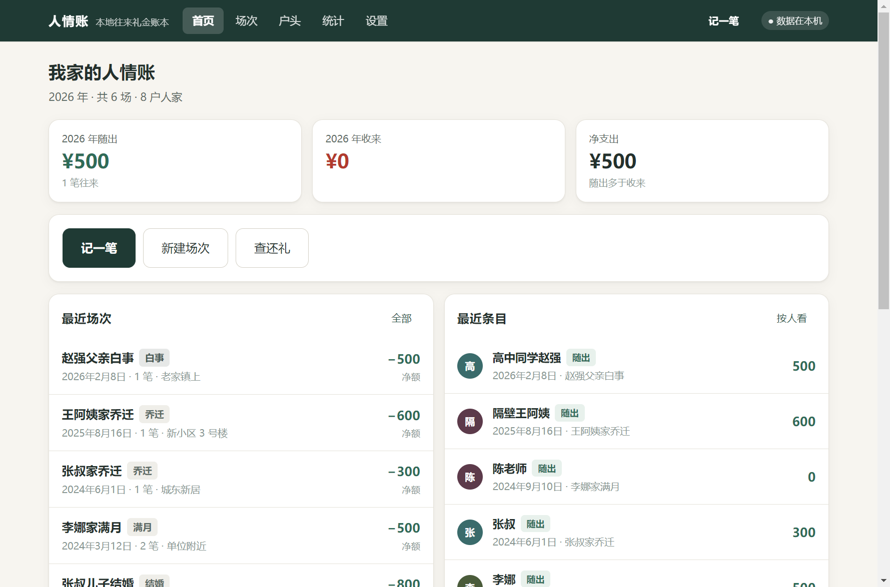
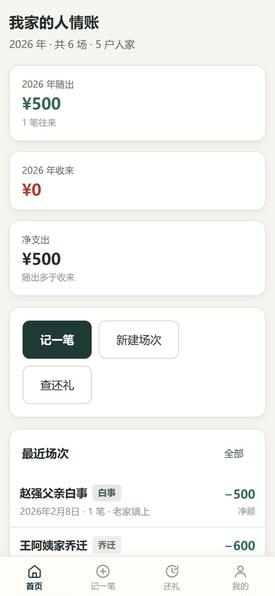
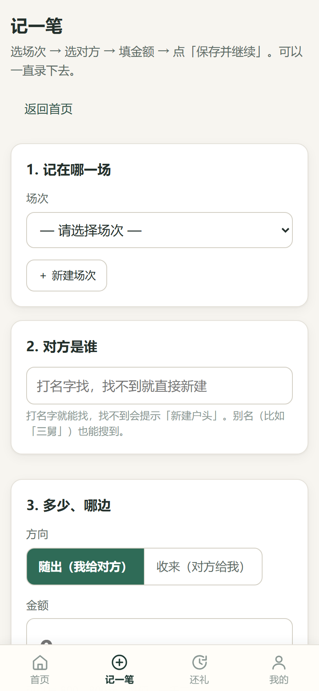
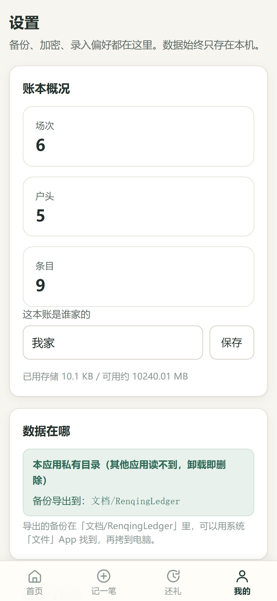
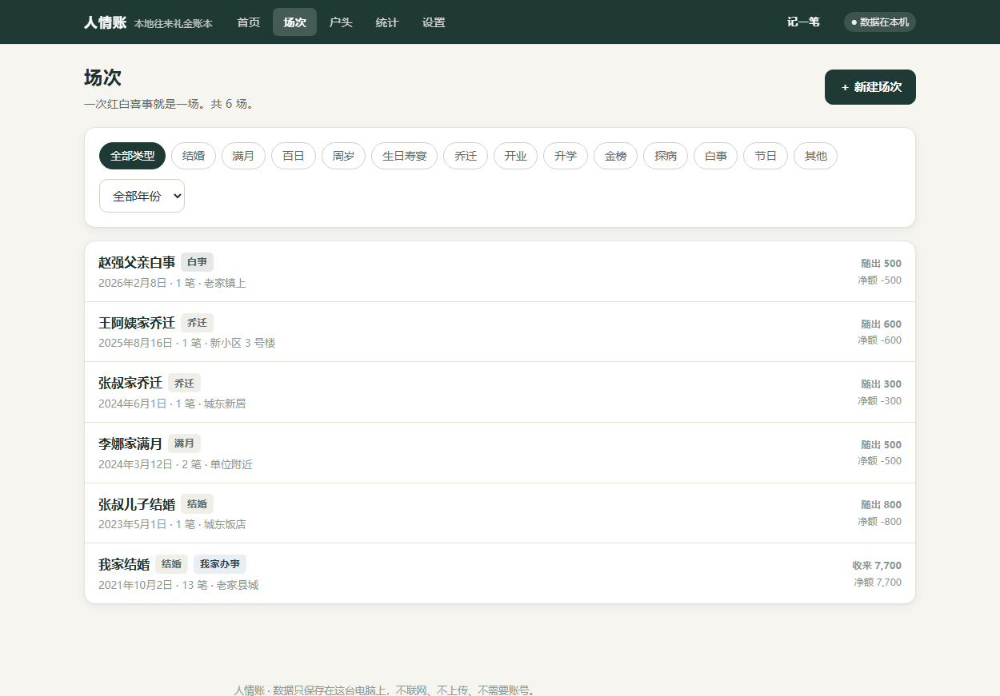
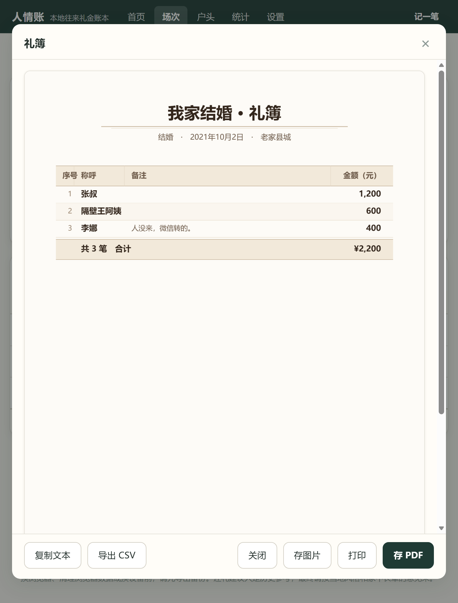

<div align="center">

# 人情账 · RenqingLedger

**完全离线的中国家庭礼金账本。**

记下谁家办事我随了多少、谁来随过我多少 —— 下次对方办事，一查就知道该回多少。

[](../../actions/workflows/test.yml)
[](../../actions/workflows/build-windows.yml)
[](../../actions/workflows/build-android.yml)
[](./LICENSE)

**简体中文 | [English](./README.en.md)**

</div>

---

## 这是什么

中国家庭的人情往来，很多人还在用本子记，或者用加密不好的手机 App。

这个项目想解决的就是这件事：一个**纯本地**的礼金账本，能记、能查、能算、能打印、能备份，
但**永远不会把你的姓名和金额传到任何服务器**。

它最想回答的其实只有一个问题：

> **「下个月他家要办事了，我该给多少？」**

|  | 云端记账 App | 人情账 |
|---|---|---|
| 数据在哪 | 厂商服务器 | **你自己的设备** |
| 要账号吗 | 要，通常手机号 | **不要** |
| 断网能用吗 | 大多不能 | **能，它根本不联网** |
| 谁可以看到 | 厂商、运维、可能的泄露 | **只有你** |
| 停止服务后 | 数据可能拿不回来 | **不受影响** |
| 费用 | 免费额度 + 会员 | **免费，MIT 开源** |

人情账里的姓名、金额、亲疏关系，是很私人的东西。
「谁家给了多少」这种事一旦泄露，比一般的消费记录更尴尬。
把它放在自己设备上，是这个问题最省心的解法。

---

## 截图

### 桌面版（Windows）



### 手机版（Android）

<p align="center">
  
  
  
</p>

手机端做了针对性适配：不显示顶栏（标题在首页、记一笔在底部导航），
文案用「手机」口径，导出走文件而非打印。

### 核心功能：该还多少



### 礼簿：一键导出 PDF 或图片



屏幕预览即最终效果 —— 手机上也能直接存成 PDF 或图片，
超过 22 笔自动分页，每页都带表头。

它**从不只给一个数字**，一定同时告诉你这个数是怎么来的：

> 2023年5月1日 他家办「结婚」，你随了 ¥800。
> 对方累计随来 ¥1,200，你累计随出 ¥1,100，对方多出 ¥100；
> 为不低于对方最近一次 ¥1,200，本次取该值。
> 按「取整到 100 元」的设置为 ¥1,200
>
> **建议：¥1,100 – ¥1,300**

---

## 下载安装

三种形态，**互相独立，各自一本账**。

### Windows：安装版 exe

1. 到 [Releases](../../releases) 下载 `RenqingLedger-Setup-<版本>.exe`
2. 双击安装。**装到当前用户，不需要管理员权限**
3. 可勾选「创建桌面快捷方式」

**关于 SmartScreen 拦截：**

安装包**没有代码签名证书**（个人项目，证书要钱）。首次运行 Windows 会弹
「Windows 已保护你的电脑」，这是正常的：

> 点 **「更多信息」** → 点 **「仍要运行」**

只在第一次需要这么做。

**装在哪、数据在哪：**

| | 位置 |
|---|---|
| 程序 | `%LOCALAPPDATA%\Programs\人情账\` |
| **账本数据** | **`%APPDATA%\RenqingLedger\`** |

数据**不在安装目录**，所以卸载重装不会丢账本。

**卸载时**会问你是否一并删除账本数据，**默认选「否」**（保留）。

### Android：APK

1. 到 [Releases](../../releases) 下载 `人情账-<版本>-release.apk`
2. 手机上点开，提示「未知来源应用」时选择允许（自签名 APK 的正常提示）
3. 桌面出现「人情账」图标

**权限**：只申请了 `INTERNET` 一条，那是 Capacitor 的 WebView 桥接用的。
应用代码里**没有任何上传账本的请求**，也没有统计 SDK。详见[隐私声明](#隐私声明)。

**账本存在应用私有目录**（其他应用读不到）。卸载应用会一起删掉，
所以**卸载前请先在「我的 → 保存备份到文件」里导出一份**。

**导出到哪**：`文档/RenqingLedger/`。用系统「文件」App 能找到，
也可以点「用系统分享发送备份」直接发到微信/邮箱/电脑。

### 浏览器：单文件 HTML

```bash
pnpm install && pnpm build:single
```

生成 `人情账.html`（约 700 KB），**双击就能用**，不用装 Node、不用起服务器、不用联网。

> ⚠️ 不要双击项目根目录的 `index.html` —— 那是给 `pnpm dev` 用的源码入口。
> 要打开的是构建出来的 `人情账.html`。
>
> ⚠️ 别随意移动这个文件。浏览器按文件路径隔离存储，换个位置账本看起来会是空的。
> 搬家前先导出备份。

### 换设备怎么把账搬过去

三种形态**各自独立**，数据不互通。跨形态迁移靠备份文件：

```
旧设备 → 设置 → 导出全库备份（.json）
      → 把文件传过去（微信/U 盘/网盘都行）
新设备 → 从备份恢复 → 选那个 .json
```

首次打开如果账本是空的，界面会给出三个选项：
**导入备份 / 载入示例 / 空白开始**。

---

## 功能

**账本核心**

- **场次**：13 种类型 —— 结婚、满月、百日、周岁、生日寿宴、乔迁、开业、
  升学、金榜、探病、白事、节日、其他
- **对方户头**：以「一户人家」为单位，不是通讯录碎片。
  支持**别名**（搜「三舅」能找到「张叔」）、关系、家庭分支、电话、备注
- **账目条目**：随出/收来双方向，礼金 + 可选的礼物估价、支付方式、经手人、备注
- 全程**软删除** —— 统计自动排除，历史仍可追溯

**还礼建议**（核心差异化）

- 纯函数实现（`src/domain/suggest.ts`）—— 不碰 React、不碰数据库、不读系统时间
- 规则：同类历史优先 → 对方最近随来 → 我最近随出；净往来为正时抬高下限；
  **白事走独立规则**（不自动加码）；可配置年份上浮；按 50 或 100 取整
- **一定展示计算依据** —— 不给黑箱数字
- 「模拟还礼」：换类型即时重算，不写账
- 礼物估价**不计入**现金建议，只在依据里提一句

**查询与统计**

- 全局搜索：称呼、姓名、别名、家庭分支、备注、场次名
- 户头详情：累计随出 / 累计收来 / 差额 + 时间线 + 模拟还礼
- 户头合并：重复户头可合并，历史记录归到一户，原称呼自动变成别名
- 统计：年度收支、按类型、按关系、月度双色柱状图，可切年份

**礼簿与导出**

- **礼簿**：自家办事可生成 A4 礼簿，一式一样，适合打出来给长辈看
- **三端都能导出，不只是电脑**：
  - **存 PDF** —— 直接生成 PDF 文件，手机上也能用
  - **存图片** —— 导出 PNG，发微信、贴群里最方便（对方不用装阅读器）
  - **打印** —— 电脑与浏览器上另有系统打印（手机没有打印子系统，故不显示）
- **超过 22 笔自动分页**：每页都带表头，合计只出现在最后一页
- 表头、列宽、页边距都按 A4 调过；**屏幕预览即最终效果**，
  三端导出的文件长得完全一样
- CSV 导出：带 UTF-8 BOM，Excel 双击不乱码
- 全库 JSON 备份与恢复，支持加密

**隐私与安全**

- 纯本地：不发起任何网络请求，无账号，无统计 SDK
- 可选应用锁：**Argon2id** 派生密钥 → **AES-GCM** 加密整库
- 自动本地备份：每天一份，保留最近 20 份
- 日志不打印姓名与金额

**体验**

- 录入快：场次 → 对方 → 金额 → **回车**（手机上是「保存并继续」按钮），
  保存后自动清空接着录
- 金额支持中文习惯与小数：`800`、`800元`、`800.50`、`捌佰`、`一千二`、`三块五`
- 边输入边建户头，键盘上下 + 回车即可选定
- 大字号模式（标准 / 大 / 特大）
- 一键载入虚构示例账本
- 删除一律二次确认
- 白事场次自动降低界面饱和色
- **手机端做了针对性适配**：底部导航取代顶栏、触控目标 ≥44px、
  文案用「手机」口径、导出走文件而非打印
- 手机端：底部导航、触控目标 ≥44px、适配刘海屏安全区

---

## 隐私声明

- 本应用**不发起任何网络请求**。没有 fetch、没有 XHR、没有 WebSocket、没有埋点
- **没有账号系统**，不收集手机号、邮箱或任何身份信息
- **没有第三方统计 SDK**
- 数据只写入本机（浏览器 IndexedDB / Electron 用户目录 / 安卓应用私有目录）
- 日志不打印姓名与金额
- 删除一律是**软删除**（`deleted_at`），导出备份里仍然保留，方便误删恢复
- 导出备份里的姓名金额是**明文**（除非你开了加密），请妥善保管备份文件
- 安卓版**关掉了系统自动备份**（`allowBackup=false`），
  数据不会被传到 Google Drive —— 迁移请用应用内的导出功能

### 关于安卓的 INTERNET 权限

APK 申请了 `android.permission.INTERNET`，这是 **Capacitor 的 WebView 桥接所需**
（原生层与网页层通过本地 `https://localhost` 通信要走网络栈）。

**它不用于上传账本。** 依据有三条：

1. 应用代码里没有任何请求远程地址的调用，也没有统计 SDK
2. 账本存在应用私有目录，导出走系统文件选择器与 Documents 目录，全程不经网络
3. 想自己验证：打开开发者工具的 Network 面板，或抓包 —— 只有本地资源请求

如果你想让系统层面彻底断网，可以注释掉
`android/app/src/main/AndroidManifest.xml` 里那一行再重新打包。
代价是 Capacitor 插件桥会失效（导出/导入文件用不了），所以默认保留。

### 桌面版

Electron 主进程禁用了渲染进程的 Node 能力（`contextIsolation: true`），
只通过 preload 暴露 8 个明确的方法（另存为、打开文件、读写路径等）。
外部链接一律交给系统浏览器，应用内不开新窗口。

---

## 还礼建议是怎么算的

算法在 `src/domain/suggest.ts`，是一个**纯函数**：给它一个户头的全部记录和目标场次类型，
它返回建议区间 + 计算依据 + 注意事项。不碰 React、不碰数据库、不读系统时间，
所以能被穷举测试。

规则按优先级：

1. **同类优先**：对方办过结婚，就参考最近一次结婚你随了多少
2. 否则看**对方最近随来**多少
3. 否则看**我最近随出**多少
4. **净往来为正且这次我随出**：不低于对方最近给过我的金额
5. **白事走独立规则**：不因为净往来为正就加码，不低于该户历史最低，
   并提示「只给历史参考」
6. **年份上浮**（可配置，默认 0%）
7. **取整**到 50 或 100（可配置）
8. **区间** = 主推 ± 一档，下沿不低于该户历史最低

礼物估价**不计入**现金建议，只在依据里提一句（「另带茅台一瓶（估价 ¥1,500）」）。

### 举例

> **张叔家**：2021 年我家结婚他随了 ¥1,200；2023 年他家儿子结婚我随了 ¥800；
> 2024 年他家乔迁我随了 ¥300。
>
> 现在听说他女儿要结婚，系统给出 **¥1,100 – ¥1,300**：
> - 2023年5月1日 他家办「结婚」，你随了 ¥800
> - 对方累计随来 ¥1,200，你累计随出 ¥1,100，对方多出 ¥100；
>   为不低于对方最近一次 ¥1,200，本次取该值
> - 按「取整到 100 元」的设置为 ¥1,200

**这只是参考。** 各地风俗差异极大，最终请按当地习惯和家中长辈的意见来。
白事尤其如此 —— 系统只给历史数字，不做任何判断。

---

## 从源码运行

需要 [Node.js](https://nodejs.org/) 18+ 和 [pnpm](https://pnpm.io/)。

```bash
pnpm install
pnpm dev          # 开发模式（热更新）→ http://localhost:5273
# 或
pnpm build && pnpm start    # 生产模式（本地服务器）
```

`pnpm start` 只监听 `127.0.0.1`，不对外网开放。
加 `--open` 会自动打开浏览器：`node scripts/serve.mjs --open`

### 为什么双击源码版会白屏？

浏览器规定 **ES Module 不能用 `file://` 加载**（安全策略，控制台报 CORS 错误）。
常规构建产出的是 `<script type="module">`，所以双击 `dist/index.html` 也会白屏。

`pnpm build:single` 专门解决这个：把 JS 和 CSS 全部内联进一个 HTML，
并改用经典脚本（IIFE）格式。经实测，`file://` 下 IndexedDB 与 WebCrypto 均可用，
所以单文件版**能真正存住数据**，不是演示玩具。

---

## 常见问题

**装完打开是空的，我之前的账呢？**

三种形态（浏览器 / 桌面 / 安卓）**各自独立**，数据不互通。
如果你之前在浏览器版里记过账，桌面版看不到是正常的 —— 用「从备份恢复」导入即可。
另外不同包名意味着全新的容器。

**安卓导出后找不到文件？**

在 `文档/RenqingLedger/` 下。用系统自带的「文件」App 打开「文档」就能看到。
找不到的话，用设置页的「用系统分享发送备份」直接发到微信/邮箱。

**礼簿我该存 PDF 还是存图片？**

看用途：

- **发给家人看** → 存图片。微信里直接就能看，对方不用装阅读器
- **要打印、或存档** → 存 PDF。A4 版式，拿去打印店直接出
- **电脑上想直接打** → 点「打印」，出来的效果与 PDF 完全一致

超过 22 笔会自动分页。多页时图片会存成多张，文件名带页码。

**为什么手机上没有「打印」按钮？**

安卓 WebView 没有打印子系统，`window.print()` 是空操作（点了没反应）。
所以手机端走「存 PDF」——效果一样，而且是文件，更方便分享。

**导出的 PDF 里文字选不中？**

是图片型 PDF（每页一张高清图封进 PDF）。这样做是为了**不嵌入中文字库** ——
字库一个字 5-10 MB，会让 APK 从 4 MB 涨到十几 MB。
代价是文字不可选、不可搜索，但打印与阅读完全正常。

**升级会不会覆盖我的数据？**

不会。账本存在用户数据目录 / 应用私有目录，与程序本体分离。
卸载重装也保留（Windows 卸载时默认不删数据；安卓卸载会删，**请先导出**）。

版本升级时 `normalizeLedger()` 会补齐缺失字段，
老版本（schema 1）的数据永远不会被新版本覆盖或清空。

**Windows 装的时候提示「Windows 已保护你的电脑」？**

因为安装包没有代码签名证书。点「更多信息」→「仍要运行」。
只在首次运行时会拦。

**安卓装的时候提示「未知来源」？**

自签名 APK 的正常提示，在设置里允许一次即可。

**数据能上云备份吗？**

不能，这是刻意的。本应用不含任何云同步代码。
想备份就导出 `.json` 存到自己的网盘/U 盘，需要时再导入。

**密码忘了怎么办？**

打不开。没有找回功能，也没有后门 —— 这是本地加密的代价。
只能从之前导出的备份恢复（如果那份备份没设密码）。

**为什么安装包 80 MB 这么大？**

Electron 自带一整个 Chromium。这是桌面壳的固有代价。
如果在意体积，可以改用 Tauri 2（同样前端代码，产物约 5 MB），
但需要 Rust 工具链。见[路线图](#路线图)。

---

## 架构

```
ui/  ──────▶ store/ ──────▶ storage/ ──────▶ IndexedDB
 │                              │                  │
 │                              └──────▶ platform/ ┘
 │                                          │
 └────────▶ domain/ ◀───────────────────────┘
              (纯函数)              (文件系统 / 原生对话框)
```

**依赖方向是单向的**：`ui → store → storage → platform`，
而 `domain` 谁都能用、它谁也不用。

```
src/
├── domain/          纯逻辑，零 React 依赖
│   ├── types.ts       领域类型（场次/户头/条目/设置）
│   ├── money.ts       金额工具，整数分运算，中文数字解析
│   ├── date.ts        日期工具，YYYY-MM-DD + Asia/Shanghai
│   ├── suggest.ts     ★ 还礼建议算法（纯函数）
│   ├── stats.ts       统计聚合
│   ├── export.ts      礼簿 / CSV 生成
│   ├── sheetCanvas.ts 礼簿渲染到 Canvas（三端共用同一份排版）
│   └── pdf.ts         PDF 生成器（手写结构，图片型，支持多页）
├── storage/         持久化
│   ├── db.ts          IndexedDB 封装
│   ├── repo.ts        仓储层：读写 / 备份 / 导入导出
│   ├── crypto.ts      Argon2id + AES-GCM
│   └── seed.ts        示例数据（虚构）
├── platform/        三端适配
│   ├── index.ts       平台判定 + 文件保存/读取分流
│   └── androidFiles.ts  安卓：Documents 目录 + 系统分享 + SAF
├── store/           Zustand 全局状态
└── ui/              界面
    ├── router.ts      约 60 行的 hash 路由
    ├── components/    通用组件（含手机底部导航）
    └── pages/         九个页面

electron/            Windows 桌面壳
├── main.cjs           主进程：窗口 / 文件对话框 / 数据目录
└── preload.cjs        只暴露 8 个方法的桥

android/             Capacitor 原生工程
docs/
└── android-signing.md 签名完整说明
```

### 几条硬规则

1. **金额在内部一律用「整数分」。**
   `amount_cents` 的语义是分，所有运算、存储、比较都用整数，
   避免 `0.1 + 0.2 !== 0.3` 这类浮点误差在账目上累积。
   **输入可以带小数**（`800.50`、`三块五`、`捌佰` 都认），
   但转换只发生在 `money.ts` 这一处入口，进来就是整数分了
2. **日期是 `YYYY-MM-DD` 字符串。** 定长字典序即时间先后，直接 `localeCompare` 排序，
   绕开 `Date` 对象的时区陷阱。「今天」由 `Intl.DateTimeFormat` 按 Asia/Shanghai 取
3. **删除是软删除。** 所有实体有 `deleted_at`，统计默认排除
4. **还礼算法不许进组件。** 它住在 `domain/suggest.ts`，改它必须同时改 `suggest.test.ts`
5. **不引入会联网的依赖。** 这是产品承诺，不是技术偏好
6. **平台差异只允许出现在 `platform/`。** 组件里不许写能力分支
7. **礼簿排版只有一份。** 屏幕预览、打印、导出的 PDF 与图片，
   全部走 `domain/sheetCanvas.ts` 同一个渲染器 ——
   不许出现两套排版（曾经打印走 CSS、导出走 Canvas，两边长得不一样）

---

## 测试

还礼算法、金额解析、PDF 结构都是纯函数，被单元测试覆盖；
三端各有独立的端到端验证。

| 层次 | 覆盖 |
|---|---|
| 单元测试 | **73 个用例** |
| 浏览器 | 26 项，CDP 驱动真实浏览器 + 真实 IndexedDB |
| 单文件版 | 8 项，`file://` 双击场景 |
| 桌面版 | 12 项，启动打包好的 exe 实测 |
| 安卓容器 | 13 项，手机视口 + 触控目标尺寸 |

单元测试的分布：

| 文件 | 覆盖 |
|---|---|
| `suggest.test.ts` | 还礼算法 15 项（含白事不加码、礼物不计入等边界） |
| `money.test.ts` | 金额工具 17 项 |
| `decimal.test.ts` | 小数点解析与回显 15 项 |
| `pdf.test.ts` | PDF 结构 16 项（含多页 xref 偏移量精确校验） |
| `sheetLayout.test.ts` | 礼簿列宽估算 10 项 |

**四个端到端测试都断言同一件事**：还礼建议必须是 `¥1,100 – ¥1,300`。
任何一端算错都会被抓出来。

### 为什么 PDF 结构要单独测

PDF 是手写的（为了不引 jsPDF 那 300 KB 依赖），结构错一个字节
阅读器就整个打不开。其中 **xref 表的偏移量**最容易写错 ——
每个对象在文件中的字节位置必须精确，差一位就打不开。
`pdf.test.ts` 逐个对象验证「文件里那个位置真的写着 `N 0 obj`」。

### 已知限制

- **未在真机上安装过 APK**：开发机没有 Android 模拟器镜像，
  安卓侧验证是在 390×844 视口下模拟 WebView 环境完成的。
  能拦住「包根本跑不起来」，但拦不住真机特有问题
  （例如不同厂商的字体宽度差异）
- **Windows 安装包未做代码签名**：SmartScreen 会拦，见上文
- Electron 产物 80 MB（自带 Chromium）
- 礼簿导出用图片型 PDF（中文不嵌字库，体积小），
  因此文件内的文字**不可选中、不可搜索**

---

## 路线图

- [ ] **识别微信聊天记录**：把聊天里的「张三 500」自动抽成条目。
      涉及读取本地文件与文本解析，会做成可选模块，默认关闭
- [ ] **多账本**：一本记自己家，一本帮父母记，互不干扰
- [ ] **移动端离线打磨**：PWA 或更好的 Capacitor 集成
- [ ] **Tauri 2 桌面壳**：约 5 MB 而不是 80 MB（需要 Rust 工具链）
- [ ] **SQLite 存储**：数据量大了之后迁移（storage 层已隔离）
- [ ] **图片附件**：给礼簿拍张照存进去
- [ ] **导入旧账本**：从 Excel / 微信导出文件批量导入

---

## 贡献

欢迎提 Issue 和 PR。几条简单的约定：

- 金额在内部**一律用整数分**运算（输入层可以收小数，转换只在 `money.ts`）
- 还礼算法改动**必须补单测**（`src/domain/suggest.test.ts`）
- **礼簿排版只改一处**：`src/domain/sheetCanvas.ts`。
  屏幕预览、打印、导出共用它，别在别处另写一套
- 界面文案用生活化中文，避免「交易/商户/SKU/流水号」这类金融 App 用语
- 不要引入任何会发起网络请求的依赖
- 提交前跑 `pnpm test && pnpm typecheck && pnpm build`

---

## 支持

如果这个项目帮你省下了一次「他家上次给了多少来着」的尴尬，
欢迎请我喝杯咖啡。完全自愿 —— 应用本身永远是免费且 MIT 开源的。

<div align="center">

<table>
<tr>
<td align="center" width="50%">

**微信**


</td>
<td align="center" width="50%">

**支付宝**


</td>
</tr>
</table>

</div>

---

## 许可

[MIT](./LICENSE)

示例账本中的人名、金额、地点**均为虚构**，仅用于演示，与任何真实人物无关。
